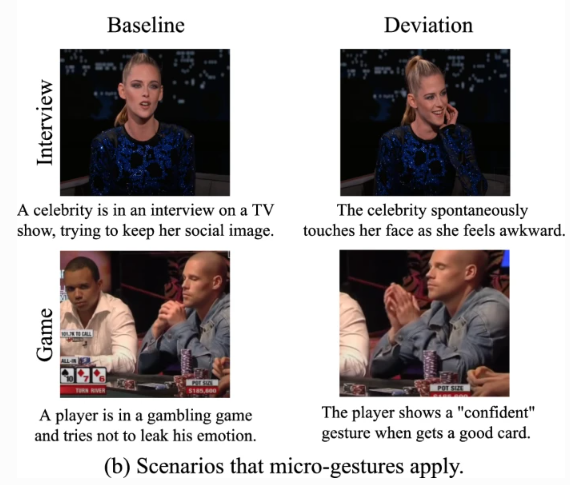
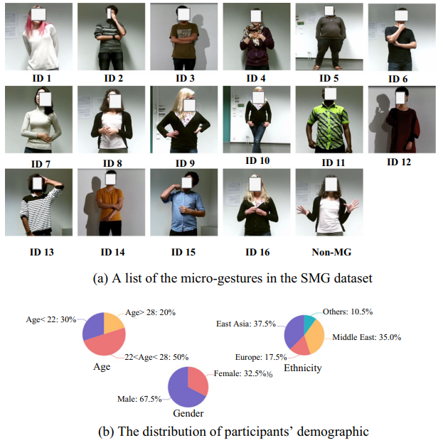

# SMG

## Paper
SMG: A Micro-Gesture Dataset Towards Spontaneous Body
Gestures for Emotional Stress State Analysis <br>
 Haoyu Chen<sup>1</sup>,
 Henglin Shi<sup>1</sup>,
 Xin Liu<sup>2</sup>,
 Xiaobai Li<sup>1</sup>,
 Guoying Zhao<sup>1</sup> <br>

 <sup>1</sup>  Center for Machine Vision and Signal Analysis, University of Oulu, Finland
 
 <sup>2</sup> Computer Vision and Pattern Recognition Laboratory, School of Engineering Science, Lappeenranta-Lahti University of Technology LUT, Finland <br>


## Contents
1. [Paper](https://link.springer.com/article/10.1007/s11263-023-01761-6)[Information about the paper.]
2. [Abstract](#Abstract)
3. [Data](#Data) [Some details about our dataset and download.]
4. [Method Zoo](#MethodZoo) [Results of different methods on SMG.]
5. [Sample code](#Samplecode) [Implementations of different methods on SMG.]
6. [Citation](#Citation)


## Abstract
We explore using body gestures for hidden emotional state analysis. As an important non-verbal communicative fashion, human body gestures are capable of conveying emotional information during social communication. In previous works, efforts have been made mainly on facial expressions, speech, or expressive body gestures to interpret classical expressive emotions. Differently, we focus on a specific group of body gestures, called micro-gestures (MGs), used in the psychology research field to interpret inner human feelings. MGs are subtle and spontaneous body movements that are proven, together with micro-expressions, to be more reliable than normal facial expressions for conveying hidden emotional information. In this work, a comprehensive study of MGs is presented from the computer vision aspect, including a novel spontaneous microgesture (SMG) dataset with two emotional stress states and a comprehensive statistical analysis indicating the correlations between MGs and emotional states. Novel frameworks are further presented together with various state-of-the-art methods as benchmarks for automatic classification, online recognition of MGs, and emotional stress state recognition. The dataset and methods presented could inspire a new way of utilizing body gestures for human emotion understanding and bring a new direction to the emotion AI community.


## Data
### Micro-Gestures examples

<div align="center">

</div>

Example scenarios to which MG recognition can be applied. In the interview or game, the subjects tend to hide their intentions, while MGs can leak their hidden emotions. 
### Dataset Statistics and Properties
<div align="center">
    
</div>
<br>

<div align="center">

</div>

The Spontaneous Micro-Gesture (SMG) dataset comprises of 40 video sequences (821,056 frames in total, more than 8 hours) from 40 participants (each sequence lasts for around 15 minutes) with RGB, depth, silhouette video streams, and skeleton data. 40 participants are recruited from a European university with multicultural backgrounds (16 countries), 27 males and 13 females with an average age of 25.

The dataset contains 71 relaxed emotional state (RES) instances and 71 stressed emotional state (SES instances). Lengths of those instances range from two to five minutes. Each participant contributes two instances or four instances (half are RESs and half are SESs). 3,692 gesture clips are labeled manually, and the average length of those MGs is 51.3 frames.


### Download
Please go to this [link](https://www.oulu.fi/en/university/faculties-and-units/faculty-information-technology-and-electrical-engineering/center-machine-vision-and-signal-analysis#accordion-control-imigue-database) for full version of the SMG dataset (RBG, skeleton and emotion states).
Note that due to the GDPR regulation, we are still working on the license to distribute the full dataset.

Or you can only download the skeleton modality of the SMG dataset via Codalab platform by participating the [MiGA competition](https://codalab.lisn.upsaclay.fr/competitions/11758).


## MethodZoo

### Comparison of MG classification accuracy (%) with state-of-the-art algorithms on the SMG dataset.

<center>
 
| Methods | Model+Modality | acc@top1 | acc@top5 |
| :-----: | :-----: | :------: | :------: |
| ST-GCN | Skeleton | 41.48 | 86.07 |
| 2 S-GCN | Skeleton | 43.11 | 86.90 |
| Shift-GCN  | Skeleton | 55.31 | 87.34 |
| GCN-NAS | Skeleton | 58.85 | 85.08 |
| MS-G3D | Skeleton | 64.75 | 91.48 |
| R3D | RGB | 29.84 | 67.87 |
| I3D | RGB | 35.08 | 85.90 |
| C3D | RGB | 45.90 | 79.18 |
| TSN | RGB | 50.49 | 82.13 |
| TRN | RGB | 59.51 | 88.53 |
| TSM | RGB | 58.69 | 83.93 |
| TSN* | RGB | 53.61 | 81.98 |
| TRN* | RGB | 60.00 | 91.97 |
| TSM* | RGB | 65.41 | 91.48 |
 
</center>


### Comparison of MG online recognition accuracy (%) with state-of-the-art algorithms on the SMG dataset.

<center> 

| Datasets | SMG | - | - | iMiGUE | - | - |
| :-----: | :-----: | :------: | :------: | :------: | :------: | :------: |
| Methods | Rec | Acc | F1 score | Rec | Acc | F1 score |
| FCN-sliding window | 0.082 | 0.110 | 0.094 | 0.059 | 0.067 | 0.063 | 
| DBN-HMM | 0.128 | 0.167 | 0.145 | – | – | – | 
| STABNet | 0.206 | 0.164 | 0.182 | 0.137 | 0.082 | 0.103 | 
| AED-BiLSTM (Ours) |  0.173 | 0.245 | 0.203 | 0.166 | 0.177 | 0.171 |
 
</center>

## Samplecode
Please go into ''classification'' folder and see README for the implementation of classification.

Please go into ''online recognition'' folder and see README for the implementation of online recognition.

## Citation
```
@article{chen2023smg,
  title={SMG: A Micro-gesture Dataset Towards Spontaneous Body Gestures for Emotional Stress State Analysis},
  author={Chen, Haoyu and Shi, Henglin and Liu, Xin and Li, Xiaobai and Zhao, Guoying},
  journal={International Journal of Computer Vision},
  volume={131},
  number={6},
  pages={1346--1366},
  year={2023},
  publisher={Springer US New York}
}
```


